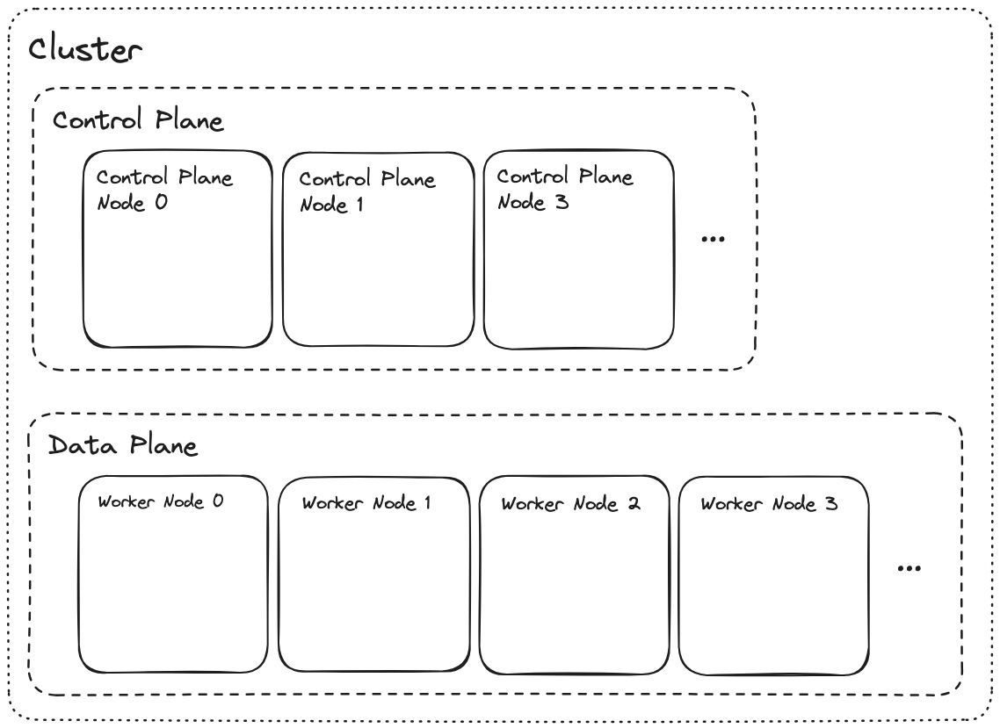
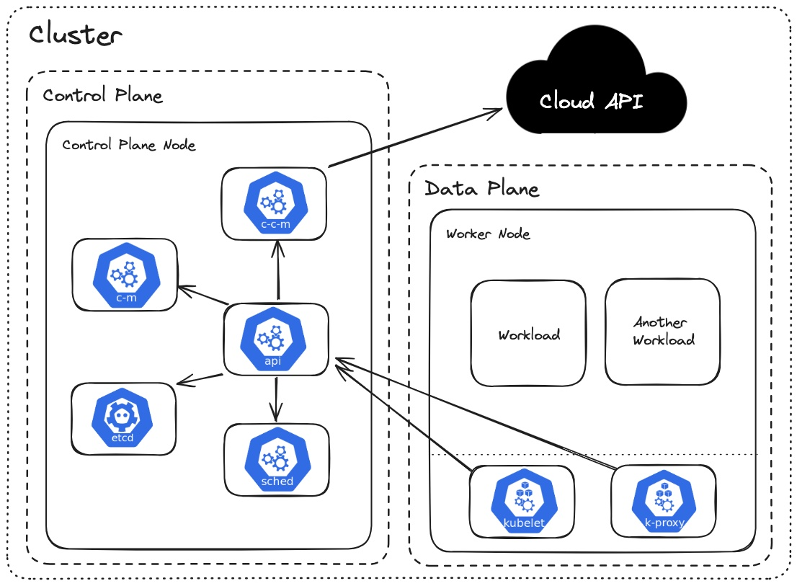

# Kubernetes Architecture
### Planes and Nodes
1. Node: A node is a computer/server running on Kuberentes. Multiple nodes join together to form a cluster.
2. Control Plane (Master node): A control plane is a subset of nodes that perform system tasks of the cluster. Nodes that are part of control plane are called Control Plane Nodes.
3. Data Plane (Worker node): A data plane is a subset of nodes that runs user worloads. Nodes that are a part of data plane are called Data Plane Nodes.

### Control Plane Components
1. etcd: Stores the key-value pairs of all the cluster data. Source of truth for cluster state and configurations.
2. api-server: Manages and controls all the requests in the control plane.
3. c-m (Controller Manager): Ensures desired cluster state.
4. scheduler: Decides which pod should a node run on.
5. c-c-m (Cloud Controller Manager): Interacts with cloud provider (AWS, Azure, etc).

### Data Plane Components
1. kubelet: Manages pod lifecycle on each node and reports back to Master node.
2. kube-proxy: Handles networking rules and load balancing.
3. container runtime: Executes containers.

