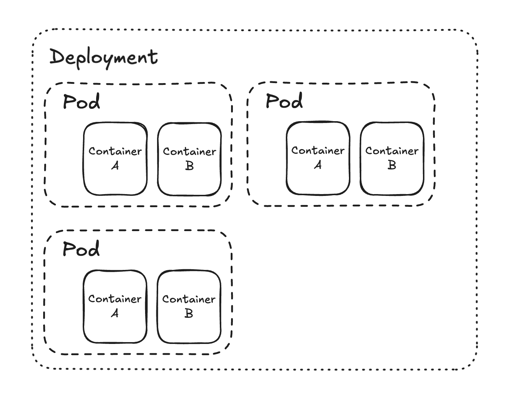

# Deployments
A deployment is a higher level resource that manages a set of pods. It solves problems of pods like scaling, rolling updates and self healing. It ensures that the desired number of pods are running at all times.

Deployments are written in YAML files which define the number of replicas, the pod template and other configurations.

A deployents provides the following features:
- Auto-scaling: It can automatically scale the number of pods based on the load.
- Rolling updates: It can update the pods without downtime by creating new pods and deleting old ones
- Auto-healing: It can automatically replace the failed pods to ensure that the desired number of pods are running at all times.




To run the deployment (in bash):
```bash
kubectl apply -f ./example.deployment.yaml
```