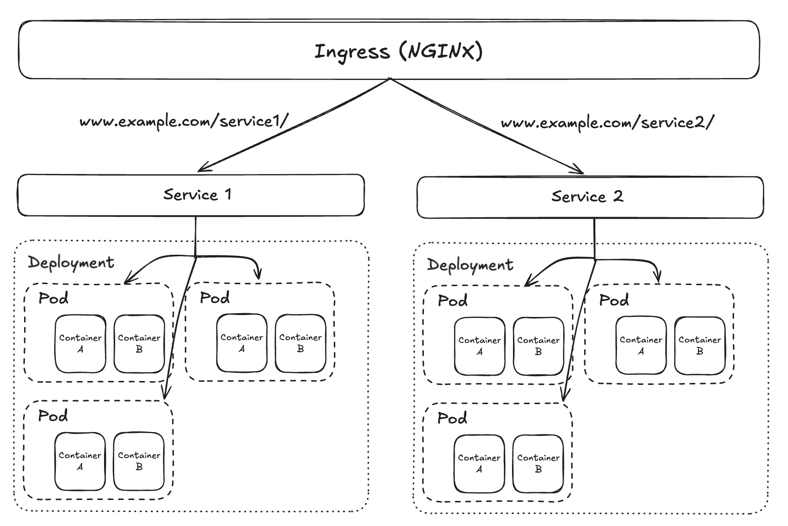

# Ingress
An ingress is a resource that solves the limitations of services by providing external access to the services. It acts as a reverse proxy and routes traffic to the services based on the rules defined in the ingress resource. It also provides features like SSL termination, path-based routing and host-based routing.

It provides features like:
- SSL termination: It can terminate SSL traffic and route it to the services over HTTP.
- Path-based routing: It can route traffic to different services based on the URL path.
- Host-based routing: It can route traffic to different services based on the host name.
- Single entry point: It provides a single entry point for all the services, which simplifies the management and reduces the cost of running multiple load balancers.

Ingress is written in YAML files which define the rules, the backend services and other configurations.



An ingress controller is required to implement the ingress resource. It is responsible for fulfilling the ingress rules and routing the traffic to the services. There are different ingress controllers available like Nginx, Traefik and HAProxy.

To run the ingress (in bash):
```bash
kubectl apply -f ./example.ingress.yaml
```