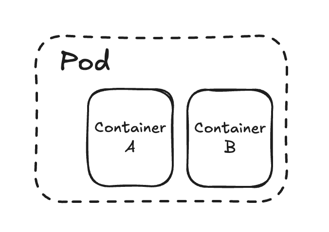

## Pods
Pods are the smallest deployable units in Kuberentes cluster in which the container runs. It can run single or multiple containers.


Pods are written in YAML files which define the containers, ports, volumes and other configurations.

Limitation - Pods are ephemeral. If it dies, the data dies along with it and doesn't restart without manual intervention

To run the pod (in bash):
```bash
kubectl apply -f ./example.pod.yaml
```