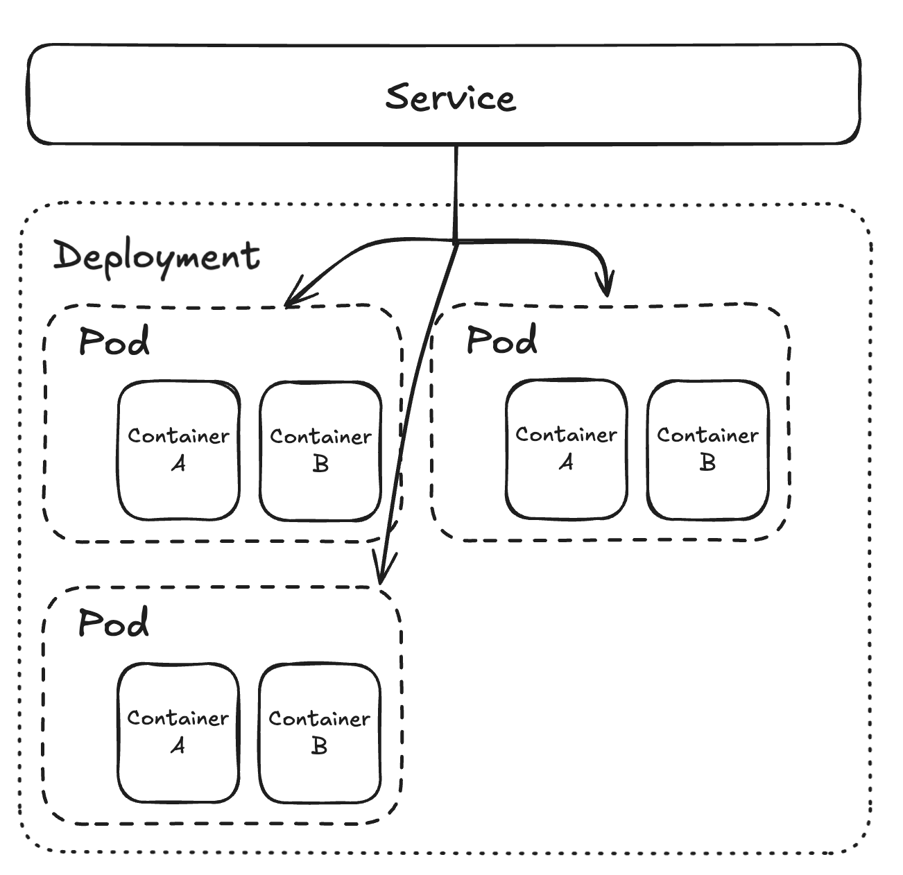

# Service
A service is a resource that provide stable network identity (IP and DNS) to a set of pods. It acts as a load balancer and routes traffic to the pods. It also provides service discovery for the pods.

The key functions of a service are:
- Load balancing: It distributes traffic across multiple pods to ensure high availability and scalability.
- Service discovery: It allows pods to discover and communicate with each other using DNS names.
- Stable network identity: It provides a stable IP address and DNS name for the pods.
- External exposure: It can expose the pods to external traffic using different types of services like NodePort, LoadBalancer and ClusterIP.


#### External exposure of services
There are three types of services that provide external exposure to the pods:
- ClusterIP: It exposes the service on a cluster-internal IP. This type of service is only accessible within the cluster.
- NodePort: It exposes the service on a static port on each node's IP. This type of service is accessible from outside the cluster using <NodeIP>:<NodePort>.
- LoadBalancer: It exposes the service using a cloud provider's load balancer. This type of service is accessible from outside the cluster using the load balancer's IP address or DNS name.

Services are written in YAML files which define the type of service, the selector and other configurations.



A service resource doesn't provide external access to the services, which is solved by ingress resource.


To run the service (in bash):
```bash
kubectl apply -f ./example.service.yaml
```
