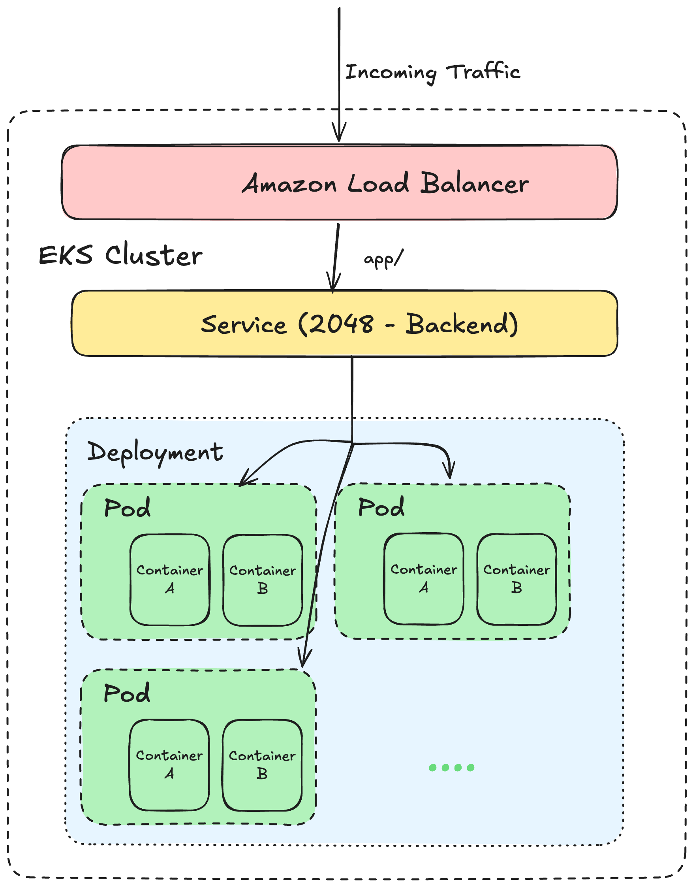

## Elastic Kuberenetes Service (EKS) Deployment
### Create an EKS cluster
Start by creating an EKS cluster using AWS CLI. 
```bash
eksctl create cluster --name demo-cluster --region us-east-1 --fargate
```
This command will create a new EKS cluster named `demo-cluster` in the `us-east

### Access the cluster using kubectl
To access the cluster, you need to update your kubeconfig file. Run the following command:
```bash
aws eks update-kubeconfig --region us-east-1 --name demo-cluster
```

### Create a fargate profile
The fargate profile allows to run your pods on AWS Fargate which is a serverless compute engine for containers. Create a fargate profile using the following command:
```bash
eksctl create fargateprofile --cluster demo-cluster --name demo-profile --namespace sample-app --region us-east-1 --name alb-sample-app 
```
So with fargate profile we don't need to worry about managing EC2 instances for Kubernetes clusters. Fargate will automatically provision and manage the compute resources needed to run your pods, allowing you to focus on deploying and managing your applications without having to worry about the underlying infrastructure.

### Deploy a sample application
To deploy an application on the EKS cluster, use the kubectl command to apply the yaml file 'sample-app.yaml' with ingress, service and deployment configuration.
```bash
kubectl apply -f sample-app.yaml
```
### Enabling ALB Ingress Controller
The problem here is that we might have introduced an ALB annotation in the sample-app.yaml file, but we haven't actually installed the ALB Ingress Controller in our EKS cluster. Currently, the ALB Ingress Controller is not installed in our EKS cluster, which is why the ALB annotations in our sample-app.yaml file are not working as expected. To resolve this issue, we need to install the ALB Ingress Controller in our EKS cluster.

To install the ALB Ingress Controller, you can follow these steps:
1. Create an IAM OpenID Connect provider for your EKS cluster:
```bash
eksctl utils associate-iam-oidc-provider --region us-east-1 --cluster demo-cluster --approve
```
We create an OIDC provider for our cluster to allow the ALB Ingress Controller to authenticate with AWS services using IAM roles.

2. Create an IAM policy for the ALB Ingress Controller:
```bash
aws iam create-policy --policy-name ALBIngressControllerIAMPolicy --policy-document file://alb-ingress-controller-iam-policy.json
```
We create an IAM policy that grants the necessary permissions for the ALB Ingress Controller to manage ALBs and related resources in our AWS account.

3. Create a Kubernetes service account for the ALB Ingress Controller:
```bash
eksctl create iamserviceaccount --region us-east-1 --name alb-ingress-controller --namespace kube-system --cluster demo-cluster --attach-policy-arn arn:aws:iam::<AWS_ACCOUNT_ID>:policy/ALBIngressControllerIAMPolicy --approve
```
We create a service account in the `kube-system` namespace for the ALB Ingress Controller and attach the IAM policy we created in the previous step to this service account. This allows the ALB Ingress Controller to assume the necessary permissions to manage ALBs in our AWS account.

4. Deploy the ALB Ingress Controller using a Helm chart:
```bash
helm repo add eks https://aws.github.io/eks-charts
helm repo update
helm install alb-ingress-controller eks/aws-alb-ingress-controller -n kube-system --set
clusterName=demo-cluster --set awsRegion=us-east-1 --set autoDiscoverAwsVpcID=true
```
We use Helm to deploy the ALB Ingress Controller in our EKS cluster. We specify the cluster name, AWS region, and enable auto-discovery of the VPC ID to ensure that the controller can properly manage ALBs in our cluster.

After installing the ALB Ingress Controller, you should be able to see the ALB annotations in your sample-app.yaml file working as expected. You can check the status of the ALB Ingress Controller by running:
```bash
kubectl get pods -n kube-system -l app.kubernetes.io/name=aws-alb-ingress-controller
```
This will show you the pods running for the ALB Ingress Controller. Once the controller is up and running, you can check the status of your ingress resources to see if the ALB is being created and associated with your application. You can do this by running:
```bash
kubectl get ingress -n sample-app
```

This will show you the ingress resources in the `sample-app` namespace, and you should see the ALB being created and associated with your application.

### Clean up
To clean up the resources created in this tutorial, you can run the following commands:
```bash
eksctl delete cluster demo-cluster --region us-east-1
```
This command will delete the EKS cluster and all associated resources. Make sure to run this command
only when you are done with the cluster, as it will permanently delete all resources and data associated with it.

### Flow of the EKS Deployment
